# Diagrama Final de Base de Datos

## Objetivo

Este diagrama resume la estructura final propuesta para **Vera**, integrando:

- acceso y usuarios;
- personas y relaciones con vehículos;
- verificaciones y calendario;
- documentos PDF;
- reportes y notificaciones;
- analítica operativa;
- cobranza y control de deuda.

## Version SVG

- [06_diagrama_final_bd.svg](./06_diagrama_final_bd.svg)

## Lectura del modelo

El modelo se organiza en cuatro capas:

### 1. Núcleo operativo

- `parties`
- `users`
- `vehicles`
- `vehicle_party_roles`
- `user_vehicle_access`

### 2. Cumplimiento y documentos

- `verification_centers`
- `verification_events`
- `verification_schedule_rules`
- `documents`
- `document_files`

### 3. Analítica y calidad del dato

- `vehicle_status_history`
- `daily_vehicle_status_snapshot`
- `verification_sessions`
- `verification_center_capacity_daily`
- `calendar_business_days`
- `data_quality_issues`

### 4. Gestión, cobranza y comunicación

- `service_orders`
- `service_order_items`
- `client_accounts`
- `receivable_documents`
- `receivable_installments`
- `payment_transactions`
- `payment_applications`
- `account_movements`
- `party_contacts`
- `report_recipients`
- `notification_rules`
- `message_templates`
- `notification_batches`
- `notification_batch_items`
- `notification_log`

## Diagrama ER Final

```mermaid
erDiagram
    PARTIES ||--o{ USERS : "puede_tener"
    PARTIES ||--o{ PARTY_CONTACTS : "tiene"
    PARTIES ||--o{ VEHICLE_PARTY_ROLES : "participa"
    PARTIES ||--o{ SERVICE_ORDERS : "es_cliente"
    PARTIES ||--|| CLIENT_ACCOUNTS : "tiene_cuenta"
    PARTIES ||--o{ REPORT_RECIPIENTS : "recibe_reportes"

    USERS ||--o{ USER_VEHICLE_ACCESS : "accede"
    USERS ||--o{ DOCUMENTS : "carga"
    USERS ||--o{ DOCUMENT_FILES : "sube"
    USERS ||--o{ NOTIFICATION_BATCHES : "genera"
    USERS ||--o{ PAYMENT_TRANSACTIONS : "registra"

    VEHICLES ||--o{ VEHICLE_PARTY_ROLES : "relacionado_con"
    VEHICLES ||--o{ USER_VEHICLE_ACCESS : "visible_para"
    VEHICLES ||--o{ VERIFICATION_EVENTS : "registra"
    VEHICLES ||--o{ DOCUMENTS : "tiene"
    VEHICLES ||--o{ SERVICE_ORDERS : "genera"
    VEHICLES ||--o{ VEHICLE_STATUS_HISTORY : "historial"
    VEHICLES ||--o{ DAILY_VEHICLE_STATUS_SNAPSHOT : "snapshot"
    VEHICLES ||--o{ VERIFICATION_SESSIONS : "sesiones"
    VEHICLES ||--o{ NOTIFICATION_BATCH_ITEMS : "notificado_en"

    VERIFICATION_CENTERS ||--o{ VERIFICATION_EVENTS : "respalda"
    VERIFICATION_CENTERS ||--o{ VERIFICATION_SESSIONS : "atiende"
    VERIFICATION_CENTERS ||--o{ VERIFICATION_CENTER_CAPACITY_DAILY : "capacidad"

    DOCUMENTS ||--o{ DOCUMENT_FILES : "versiones"
    DOCUMENTS ||--o{ VERIFICATION_EVENTS : "respalda_evento"

    SERVICE_ORDERS ||--o{ SERVICE_ORDER_ITEMS : "detalla"
    SERVICE_ORDERS ||--o{ RECEIVABLE_DOCUMENTS : "origina"

    CLIENT_ACCOUNTS ||--o{ RECEIVABLE_DOCUMENTS : "genera"
    CLIENT_ACCOUNTS ||--o{ PAYMENT_TRANSACTIONS : "recibe"
    CLIENT_ACCOUNTS ||--o{ ACCOUNT_MOVEMENTS : "movimientos"

    RECEIVABLE_DOCUMENTS ||--o{ RECEIVABLE_INSTALLMENTS : "divide"
    RECEIVABLE_DOCUMENTS ||--o{ PAYMENT_APPLICATIONS : "recibe_aplicacion"

    PAYMENT_TRANSACTIONS ||--o{ PAYMENT_APPLICATIONS : "se_aplica_en"

    REPORT_RECIPIENTS ||--o{ NOTIFICATION_BATCHES : "origina"
    PARTY_CONTACTS ||--o{ NOTIFICATION_BATCHES : "destinatario"
    NOTIFICATION_RULES ||--o{ NOTIFICATION_BATCHES : "dispara"
    MESSAGE_TEMPLATES ||--o{ NOTIFICATION_BATCHES : "usa"
    NOTIFICATION_BATCHES ||--o{ NOTIFICATION_BATCH_ITEMS : "incluye"
    NOTIFICATION_BATCHES ||--o{ NOTIFICATION_LOG : "bitacora"

    PARTIES {
        bigint id PK
        string party_type
        string rfc
        string legal_name
        string display_name
        string phone
        string email
    }

    USERS {
        bigint id PK
        bigint party_id FK
        string email
        string password_hash
        string full_name
        boolean is_admin
    }

    PARTY_CONTACTS {
        bigint id PK
        bigint party_id FK
        string contact_name
        string email
        string whatsapp_phone
        boolean receives_reports
    }

    VEHICLES {
        bigint id PK
        string plate
        string serial_niv
        string engine_number
        string unit_type
        string regime
        string schedule_marker_effective
        boolean is_active
    }

    VEHICLE_PARTY_ROLES {
        bigint id PK
        bigint vehicle_id FK
        bigint party_id FK
        string role_type
        boolean is_current
    }

    USER_VEHICLE_ACCESS {
        bigint id PK
        bigint user_id FK
        bigint vehicle_id FK
        string access_type
        boolean is_active
    }

    VERIFICATION_CENTERS {
        bigint id PK
        string center_type
        string code
        string name
    }

    VERIFICATION_EVENTS {
        bigint id PK
        bigint vehicle_id FK
        bigint center_id FK
        bigint source_document_id FK
        string verification_type
        date event_date
        date valid_until
        string result_status
    }

    VERIFICATION_SCHEDULE_RULES {
        bigint id PK
        string regime
        int schedule_position
        string schedule_marker
        string verification_type
    }

    DOCUMENTS {
        bigint id PK
        bigint vehicle_id FK
        bigint related_party_id FK
        string document_type
        string verification_type
        date valid_until
        boolean is_visible_to_owner
    }

    DOCUMENT_FILES {
        bigint id PK
        bigint document_id FK
        int version_no
        string mime_type
        string storage_kind
        string storage_path
        boolean is_current
    }

    VEHICLE_STATUS_HISTORY {
        bigint id PK
        bigint vehicle_id FK
        date status_date
        string physical_status
        string emissions_status
    }

    DAILY_VEHICLE_STATUS_SNAPSHOT {
        bigint id PK
        date snapshot_date
        bigint vehicle_id FK
        bigint client_party_id FK
        string regime
        string schedule_marker_effective
    }

    VERIFICATION_SESSIONS {
        bigint id PK
        bigint vehicle_id FK
        bigint center_id FK
        string verification_type
        datetime scheduled_at
        datetime finished_at
        int duration_minutes
        string session_result
    }

    VERIFICATION_CENTER_CAPACITY_DAILY {
        bigint id PK
        bigint center_id FK
        date capacity_date
        int lines_available
        numeric hours_open
        int capacity_operational
    }

    CALENDAR_BUSINESS_DAYS {
        date calendar_date PK
        boolean is_business_day
        boolean is_holiday
        string holiday_name
    }

    DATA_QUALITY_ISSUES {
        bigint id PK
        string entity_type
        bigint entity_id
        string issue_type
        string severity
        string status
    }

    SERVICE_ORDERS {
        bigint id PK
        string folio
        bigint vehicle_id FK
        bigint client_party_id FK
        date service_date
        string service_type
    }

    SERVICE_ORDER_ITEMS {
        bigint id PK
        bigint service_order_id FK
        string concept
        decimal amount
    }

    CLIENT_ACCOUNTS {
        bigint id PK
        bigint client_party_id FK
        string account_status
        decimal credit_limit
        int credit_days
    }

    RECEIVABLE_DOCUMENTS {
        bigint id PK
        bigint client_account_id FK
        bigint service_order_id FK
        string document_type
        string folio
        date issue_date
        date due_date
        decimal total_amount
        decimal balance_amount
        string receivable_status
    }

    RECEIVABLE_INSTALLMENTS {
        bigint id PK
        bigint receivable_document_id FK
        int installment_no
        date due_date
        decimal amount_due
        decimal amount_paid
        string installment_status
    }

    PAYMENT_TRANSACTIONS {
        bigint id PK
        bigint client_account_id FK
        date payment_date
        string payment_method
        decimal amount
        string status
    }

    PAYMENT_APPLICATIONS {
        bigint id PK
        bigint payment_transaction_id FK
        bigint receivable_document_id FK
        bigint receivable_installment_id FK
        decimal applied_amount
    }

    ACCOUNT_MOVEMENTS {
        bigint id PK
        bigint client_account_id FK
        datetime movement_date
        string movement_type
        decimal debit_amount
        decimal credit_amount
        decimal balance_after
    }

    REPORT_RECIPIENTS {
        bigint id PK
        bigint client_party_id FK
        bigint party_contact_id FK
        string channel
        string report_type
    }

    NOTIFICATION_RULES {
        bigint id PK
        string rule_code
        string report_type
        string verification_type
        string trigger_status
        int trigger_offset_days
    }

    MESSAGE_TEMPLATES {
        bigint id PK
        string template_code
        string channel
        string template_name
    }

    NOTIFICATION_BATCHES {
        bigint id PK
        bigint report_recipient_id FK
        bigint party_contact_id FK
        bigint client_party_id FK
        bigint rule_id FK
        bigint template_id FK
        string channel
        datetime scheduled_for
        string status
        string dedupe_key
    }

    NOTIFICATION_BATCH_ITEMS {
        bigint id PK
        bigint batch_id FK
        bigint vehicle_id FK
        string verification_type
        string due_status
        date due_date
    }

    NOTIFICATION_LOG {
        bigint id PK
        bigint batch_id FK
        string channel
        string destination
        string delivery_status
        datetime sent_at
    }
```

## Notas de diseño

### Acceso al propietario

El acceso del propietario no depende del rol jurídico directo en `vehicle_party_roles`.

Se controla mediante:

- `user_vehicle_access`

Esto permite:

- propietarios;
- gestores;
- administradores de flota;
- usuarios autorizados temporalmente.

### Documentos visibles

No todos los documentos deben mostrarse al propietario.

La visibilidad se controla en:

- `documents.is_visible_to_owner`

### Cobranza separada

La deuda, cartera, pagos y movimientos deben permanecer fuera del portal del propietario.

Las tablas de cobranza son internas:

- `client_accounts`
- `receivable_documents`
- `receivable_installments`
- `payment_transactions`
- `payment_applications`
- `account_movements`

### Analítica separada

La analítica no debe recalcular todo desde tablas transaccionales en tiempo real.

Se recomienda operar con:

- `vehicle_status_history`
- `daily_vehicle_status_snapshot`
- `verification_center_capacity_daily`

para reportes históricos, proyección y saturación.
